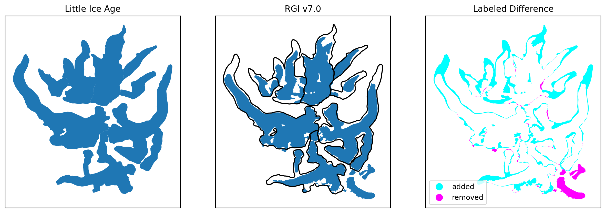
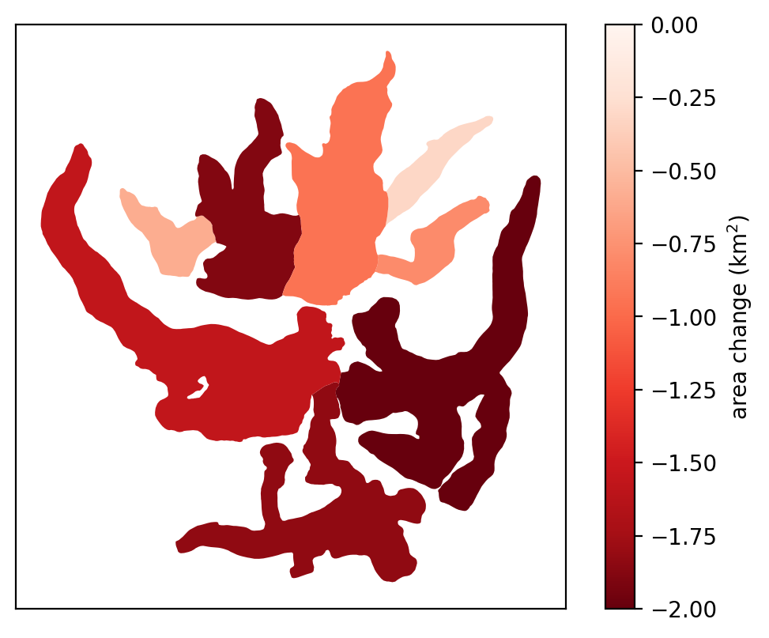
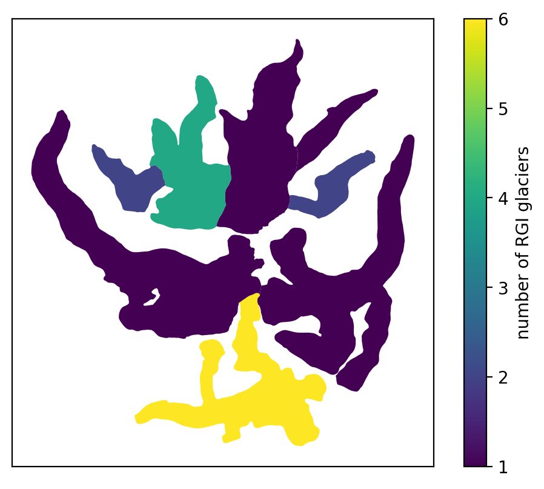

# glacier change mapping tools

## installing

After cloning the repository, navigate to the parent folder of the repository and run the following:

```bash
pip install gcmt
```

Alternatively, install a 'development' version:

```bash
pip install -e gcmt
```

You can also use `conda` to create a new environment with the necessary dependencies,
using the provided `environment.yml` file.

## usage examples

The `GlacierOutlines` class is based on [geoutils.Vector](https://geoutils.readthedocs.io/en/stable/vector_class.html),
and is created in the same way:

```python
from gcmt.geometry import GlacierOutlines

outlines = GlacierOutlines('sample_outlnes.gpkg')
```

It has all of the attributes and methods of the `Vector` class (or the 
[geopandas.GeoDataFrame](https://geopandas.org/en/stable/docs/reference/api/geopandas.GeoDataFrame.html)), with a
handful of additional attributes and methods intended to make calculating glacier area changes easier:

- `.validate()`, for checking/validating outlines
- `.labeled_difference()`, for computing a labeled symmetric difference between two sets of glacier outlines
- `.compute_area_change()`, for computing the area change between two sets of glacier outlines

### validating geometries

Outlines can be checked for validity using `.validate()`:

```python
outlines.validate()
```

which checks for the following:

- *overlaps*: based on the assumption that outlines from a single point in time should not overlap. Can be ignored
  using `overlap_ok=True`.
- *multi-part geometry*: based on the assumption that glacier outlines should be a single polygon. Can be ignored
  using `multi_ok=True`.
- *invalid geometry*: checks for validity using [GeoSeries.is_valid](https://geopandas.org/en/stable/docs/reference/api/geopandas.GeoSeries.is_valid.html)

If all checks have passed, the final step is running [GeoSeries.remove_repeated_points()](https://geopandas.org/en/stable/docs/reference/api/geopandas.GeoSeries.remove_repeated_points.html)
to clean up the outlines, before saving to a new directory, `cleaned/`, in the same folder.

If any checks fail, the geometries that caused the error ar saved to the `error/` directory for review.

### labeled symmetric differences

To show areas that are included in one set of outlines, but not in another, use `.labeled_difference()`:

```python

rgi_outlines = outlines.filter_other(GlacierOutlines(utils.rgi_loader('path_to_rgi', 1)))
difference = outlines.labeled_difference(rgi_outlines)
```

This creates a new `GlacierOutlines` with a single feature, `difference`. Areas that are included in the current
set of outlines, but not in the other geometry, are labeled as 'added', while areas not in the current outlines but
included in the other geometry are labeled as 'removed'. The result enables us to plot areas of, for example,
advance/retreat easily.

The plot below shows an example of this, with the example outlines on the left, the RGI v7.0 outlines in the middle, and
the labeled difference between the example outlines and the RGI on the right:



Cyan indicates areas that are within the example outlines but not included in the RGI outlines, while magenta indicates
areas that are within the RGI but not included in the example outlines. 

### computing area change

```python
change = outlines.compute_area_change(rgi_outlines,
                                      crs='epsg:3338', # use Alaska Albers for area computation
                                      sign='neg')
```

This method returns a new `GlacierOutlines` object with the following attributes:

- **area**: the area of the outline, in the specified CRS (or the estimated UTM CRS for the current outlines)
- **other_area**: the area of all outlines in `other` whose representative point falls within the outline
- **area_change**: the difference between **area** and **other_area**
- **num_other**: the number of outlines in `other` whose representative point falls within the outline
- **other_ids**: the ids for the outlines in `other` whose representative point falls within the outline
- **geometry**: the outline from this set of outlines.

To plot the area change, then, we can use `.ds.plot()`:

```python
change.ds.plot(column='area_change', cmap='Reds_r', vmax=0, vmin=-2, 
               legend=True, legend_kwds={"label": "area change (km$^2$)"})
```

The result of this is a plot that shows the LIA outlines, colored by the area change between the LIA and the RGI, using
the area of each of the RGI outlines that are contained within the LIA outline:



Additionally, we can use `.ds.plot()` to show the number of RGI glaciers within each of the LIA outlines from our
example:

```python
change.ds.plot(column='num_other', legend=True, legend_kwds={"label": "number of RGI glaciers"})
```




### rgi convenience functions

In addition to computing changes between generic outlines, `GlacierOutlines` objects can also be used to compare directly
with [Randolph Glacier Inventory (RGI)](https://www.glims.org/rgi_user_guide/welcome.html) outlines:

- `.compute_rgi_area_change()` - for computing the area change between the outlines and the RGI
- `.join_rgi()` - for joining the RGI outlines to the

Rather than a `GlacierOutlines` or filename, just pass the RGI region and directory where the RGI outlines are
saved on your computer:

```python
change = sample.compute_rgi_area_change(rgi_reg=1,
                                        rgi_dir=path_to_rgi,
                                        crs='epsg:3338')
```

The `utils` module can also be used to load RGI shapefiles directly:

```python
from gcmt import utils

utils.rgi_loader(path_to_rgi, rgi_reg=1, version='v7.0')
```

